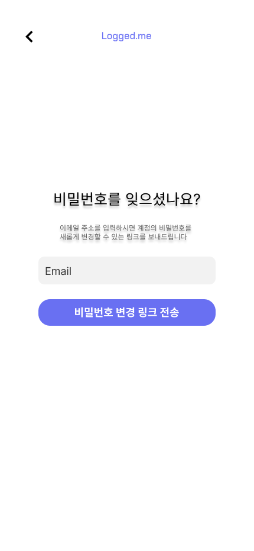
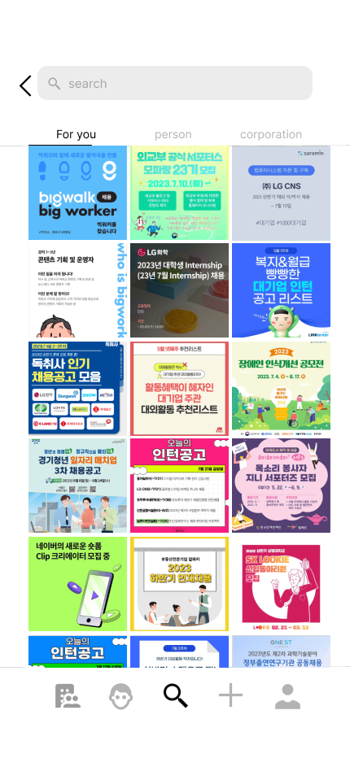
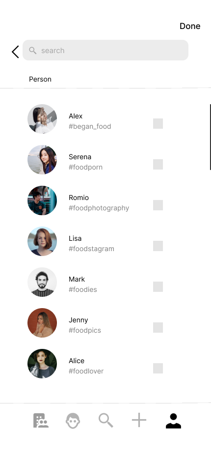
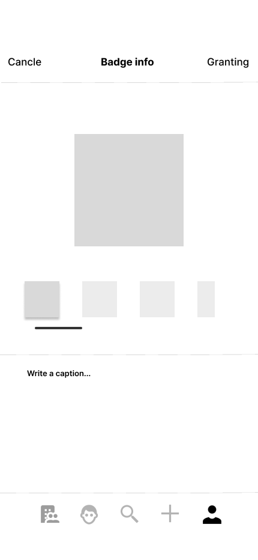
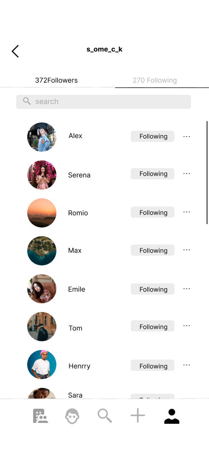
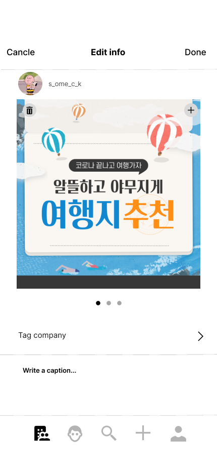

# Logged.ME_Frontend

> 멋쟁이사자처럼 11기 중앙해커톤 상명대학교 Logged.me 팀 

### 기업의  **헤드헌팅**과 취준생들의  **대외활동**을 위한 소셜미디어 구현
수도권, 지방 **지역**구분 없이 누구든지 자유롭게 기업의 모집공고를 확인할 수 있고, 공모전 등 대외활동에 참여할 기회를 얻을 수 있으며, 어떤 기업이던지 전국에 있는 숨은 고수들, 원하는 인재들을 **헤드헌팅** 할 수 있습니다.

|  | 역할 | 담당 |
|------|---|---|
|팀장|프론트엔드|김연출|
|팀장|백엔드|김동주|
|팀원|백엔드|백승우|
|팀원|프론트엔드|민기홍|
|팀원|프론트엔드|이유민|
|팀원|기획/디자인|정은희|


## 목차

Ⅰ) **기술 스택**

Ⅱ) **프로젝트 사용해보기**

Ⅲ) **주요 기능**

Ⅳ) **UI/UX**

Ⅴ) **프로젝트 구현 기술**

## Ⅰ) 기술 스택

### 사용 언어

- Vanilla JS & JQuery
- DJango Rest FrameWork

### Client

- EC2

### Server

- RDS & EC2

- mockup API를 통한 FE-BE 연계 작업
- git - slack 연동
- debounce, throttle을 이용한 server traffic management
- git action을 이용한 CI/CD


## Ⅱ) 프로젝트 사용해보기

-  **http://13.125.224.114/** 에서 서비스를 이용할 수 있습니다.

- 다음 ID로 로그인하여 서비스 이용이 가능합니다.

  - ID : **test@test.com**
  - PW : **1234**

- 회원가입을 통해서도 서비스 이용이 가능합니다.


**※** 프로젝트에 사용된 **ERD & API**는 다음 사이트에 정리하였습니다.
- **Notion : https://www.notion.so/likelionsmu/ERD-970d545ed2c34fea882b4e180e637583?pvs=4**
- **Notion: https://www.notion.so/likelionsmu/API-2c4581acdbf94e0e9a6437c4447eeee0?pvs=4**

## Ⅲ) 주요 기능

- 비회원 시 로그인, 회원가입, 이메일 인증, 비밀번호 재설정 기능을 사용할 수 있습니다.
  
- 프로필 창에서 profile image, handle, name 등을 변경할 수 있습니다.

- 태그 추천 및 검색 시 계정 추천이 제공됩니다.

- 피드 작성 및 수정, 프로필 작성 및 수정, 팔로우 및 팔로우 취소가 가능합니다.

- 개인 계정 / 기업 계정 생성이 가능합니다.

- 계정 유형에 맞게 서비스 사용이 가능합니다.

### 개인 계정

- 자신이 참가한 공모전, 대외활동, 동아리 등의 이력을 피드에 작성하여 하나의 포트폴리오처럼 사용이 가능합니다.

### 기업 계정

- 회사에 적합한 인재에게 스카웃 제의 및 자신의 기업을 홍보하는 글을 작성할 수 있습니다.

- 개인 사용자에게 뱃지 부여가 가능합니다.

## Ⅳ) UI/UX

### 1. 회원가입

> 이메일 인증을 통해 회원가입이 가능합니다.
> 실시간 유효성 검사를 적용했습니다.


### 2. 로그인

> 회원가입한 정보로 로그인할 수 있습니다.


### 3. 비밀번호 찾기

> 등록한 이메일을 사용해 인증 코드로 비밀번호 초기화가 가능합니다




#### 4. 비밀번호 재설정

> 친구 ID를 입력하여 친구를 추가할 수 있습니다. 만약 이미 친구라면 1:1 채팅 버튼이 나옵니다.


#### 5. 기업 피드

> 사용자가 팔로우한 기업 계정의 피드를 볼 수 있습니다.

> 좋아요, 댓글, 링크 공유, 스크랩 기능의 사용이 가능합니다.


### 6. 개인 피드

> 사용자가 팔로우한 개인 계정의 피드를 볼 수 있습니다.

> 좋아요, 댓글, 링크 공유, 스크랩 기능의 사용이 가능합니다.


#### 7. 댓글 모달

> 사용자가 피드에 댓글을 남길 수 있습니다.

> 본인의 댓글이라면 삭제가 가능합니다.


#### 7. 프로필

> 사용자가 자신 또는 다른 사용자의 프로필을 방문할 수 있습니다.

> 부여(기업)하거나 부여받은(개인) 뱃지를 확인할 수 있습니다.

> 팔로우, 팔로워 목록 및 피드, name, handle을 확인할 수 있습니다.


#### 8. 탐색

> 사용자, 피드, 해쉬태그를 검색할 수 있습니다.

> debounce를 사용하여 traffic을 제어합니다.




#### 9. 뱃지

> 기업사용자는 개인사용자에게 뱃지를 부여할 수 있습니다.

> 시나리오에 따라 부여합니다.






#### 10. 팔로우리스트

> 팔로우, 팔로워 리스트를 확인할 수 있습니다.

> 팔로우 요청과 취소가 가능합니다.




#### 11. 알림페이지

> 사용자에게 일어난 이슈를 확인할 수 있습니다.


#### 8. 게시물 작성 및 수정

> 게시물 작성 및 수정이 가능합니다.





## Ⅴ) 프로젝트 구현 기술

### 1. debounce

> ajax network traffic management를 위해 debounce로 search 시 debounce 사용

```
 var timer;
$(".follow_list_main_search_input").on("input", function () {
  if (timer) {
    clearTimeout(timer);
  }
  timer = setTimeout(function () {
    const query = $(".follow_list_main_search_input").val();
    // console.log(query);
    $(".item_userName").each(function () {
      var personName = $(this).text().toLowerCase();
      // console.log(personName);
      if (personName.includes(query)) {
        $(this).parent().show();
      } else {
        $(this).parent().hide();
      }
    });
  }, 300);
});

                    ......
```
