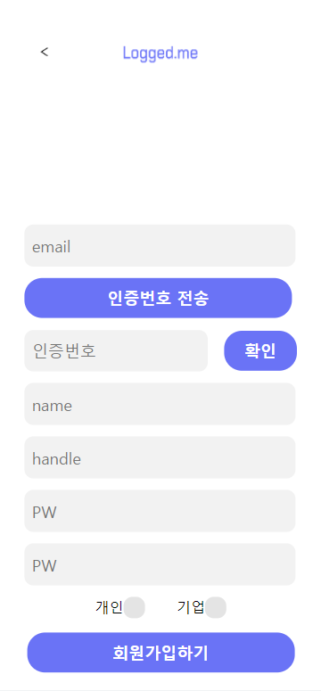
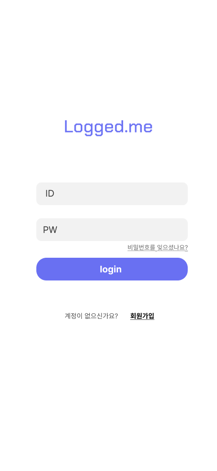

# Logged.ME_Frontend

> 멋쟁이사자처럼 11기 중앙해커톤 상명대학교 Logged.me 팀 

### 기업의  **헤드헌팅**과 취준생들의  **대외활동**을 위한 소셜미디어 구현
수도권, 지방 **지역**구분 없이 누구든지 자유롭게 기업의 모집공고를 확인할 수 있고, 공모전 등 대외활동에 참여할 기회를 얻을 수 있으며, 어떤 기업이던지 전국에 있는 숨은 고수들, 원하는 인재들을 **헤드헌팅** 할 수 있습니다.

## 목차

Ⅰ) **기술 스택**

Ⅱ) **프로젝트 사용해보기**

Ⅲ) **주요 기능**

Ⅳ) **UI/UX**

Ⅴ) **프로젝트 구현 기술**

## Ⅰ) 기술 스택

### 사용 언어

- Vanilla JS & JQuery
- DJango Rest FrameWork

### Client

- EC2

### Server

- RDS & EC2

- mockup API를 통한 FE-BE 연계 작업
- git - slack 연동
- debounce, throttle을 이용한 server traffic management
- git action을 이용한 CI/CD


## Ⅱ) 프로젝트 사용해보기

-  **http://13.125.224.114/** 에서 서비스를 이용할 수 있습니다.

- 다음 ID로 로그인하여 서비스 이용이 가능합니다.

  - ID : **test@test.com**
  - PW : **1234**

- 회원가입을 통해서도 서비스 이용이 가능합니다.


**※** 프로젝트에 사용된 **ERD & API**는 다음 사이트에 정리하였습니다.
- **Notion : https://www.notion.so/likelionsmu/ERD-970d545ed2c34fea882b4e180e637583?pvs=4**
- **Notion: https://www.notion.so/likelionsmu/API-2c4581acdbf94e0e9a6437c4447eeee0?pvs=4**

## Ⅲ) 주요 기능

- 비회원 시 로그인, 회원가입, 이메일 인증, 비밀번호 재설정 기능을 사용할 수 있습니다.
  
- 프로필 창에서 profile image, handle, name 등을 변경할 수 있습니다.

- 태그 추천 및 검색 시 계정 추천이 제공됩니다.

- 피드 작성 및 수정, 프로필 작성 및 수정, 팔로우 및 팔로우 취소가 가능합니다.

- 개인 계정 / 기업 계정 생성이 가능합니다.

- 계정 유형에 맞게 서비스 사용이 가능합니다.

### 개인 계정

- 자신이 참가한 공모전, 대외활동, 동아리 등의 이력을 피드에 작성하여 하나의 포트폴리오처럼 사용이 가능합니다.

### 기업 계정

- 회사에 적합한 인재에게 스카웃 제의 및 자신의 기업을 홍보하는 글을 작성할 수 있습니다.

- 개인 사용자에게 뱃지 부여가 가능합니다.

## Ⅳ) UI/UX

### 1. 회원가입

> 이메일 인증을 통해 회원가입이 가능합니다.
> 실시간 유효성 검사를 적용했습니다.



### 2. 로그인

> 회원가입한 정보로 로그인할 수 있습니다.




### 3. 비밀번호 초기화

> 등록한 이메일을 사용해 인증 코드로 비밀번호 초기화가 가능합니다


#### 3.1 친구 추가

> 친구 ID를 입력하여 친구를 추가할 수 있습니다. 만약 이미 친구라면 1:1 채팅 버튼이 나옵니다.


#### 3.2 친구 검색

> 검색 창에 입력한 단어가 이름에 있는 친구들을 찾습니다.


### 4. 채팅 메뉴

> - 해당 메뉴에서는 채팅방 목록 확인 및 검색 등이 가능합니다.
> - 채팅방은 최근 수신한 채팅 날짜 순으로 정렬되어 있으며, 읽지 않은 채팅 수가 표시됩니다.
> - 채팅방을 더블 클릭 시 채팅방에 입장하게 됩니다.


#### 4.1 새로운 채팅

> - 친구 목록에서 채팅 할 대상을 선택하여 대화할 수 있습니다.
> - 검색을 통해 대화할 친구를 찾을 수도 있습니다.


#### 4.2 채팅방 검색

> 검색 단어가 방 참가자 또는 방 이름에 있는 채팅방들을 나타냅니다.


### 5. 채팅방

> - 채팅방에서 다른 사용자와 대화를 할 수 있습니다.
> - 친구가 아닐 경우, 경고창이 뜨고 원하면 친구 추가를 할 수 있습니다.
> - 스크롤이 위로 올라가 있을 때, 상대방이
메시지를 보내면 알려줍니다.


### 6. Profile

> 친구 메뉴, 채팅방 등에서 사진을 클릭 시 프로필 창이 등장합니다. 해당 창에서 사용자 정보를 변경할 수 있습니다.

1. **나의 프로필**
  


-------------

2. **친구 프로필**

> 친구의 경우, 이름 변경만 가능합니다.


## Ⅴ) 프로젝트 구현 기술

### 1. webpack

> CRA(create-react-app)를 통해 프로젝트를 진행하지 않고, Webpack을 이용하여 직접 개발환경을 설정하였습니다. 이를 통해 Customize하게 개발 환경을 구성할 수 있습니다.

```
  mode: process.env.NODE_ENV,

  entry: "./src/index.tsx",

  resolve: {
    extensions: [".ts", ".tsx", '.js'],
    plugins: [new TsconfigPathsPlugin({ configFile: "./tsconfig.json" })]
  },
  module: {
    rules: [
      {
        test: /\.tsx?$/,
        loader: "babel-loader",
        exclude: /node_modules/
      },
      {
          test: /\.tsx?$/,
          loader: 'ts-loader'
      }
    ]
  },

                    ......
```


### 2. Styled-Components

> **Styled-Components**를 사용하여 **CSS-in-JS**를 구현하였습니다. 이를 통해 CSS 모델을 문서 레벨이 아니라 컴포넌트 레벨로 추상화하여, 스타일 시트를 더 이상 유지 보수할 필요가 없도록 하였습니다.

글로벌적으로 설정해야 하는 스타일(ex) body, div, input 등)이나, 재사용할 수 있는 스타일은 **styles** 폴더에 따로 분리하였습니다. 그 후 다른 컴포넌트에서 import하여 사용하였습니다.

```
const GlobalStyle = createGlobalStyle`
     * {
       box-sizing: border-box;
     }
     body {
      width: 100%;
      height: 100%;
    }
     body, div, ul, li, dl, dd, dt, ol, h1, h2, h3, h4, h5, h6, input, fieldset, legend, p, select, table, th, td, tr, textarea, button, form, figure, figcaption {
      padding: 0;
      margin: 0;
    }
                      ......
```

### 3. 스크롤 페이징

> 채팅방에 스크롤 페이징 기술을 접목하였습니다. 이를 통해 처음부터 모든 채팅 내용을 서버에서 가져오는 것이 아니라, 사용자가 원할 때만 이전 채팅 내용을 가져오기 때문에 리소스 낭비를 막을 수 있습니다.

#### 이전 채팅 불러오기


### 4. Socket.io

> - 채팅의 실시간 양방향 통신을 위하여 Socket.io를 사용하였습니다.
> - 채팅의 전반적인 기능(메시지 송수신, 알림 등)에 사용하여 실시간으로 채팅이 이루어지도록 구현하였습니다.

#### test01과 test02의 채팅


#### 채팅 알림


### 5. Sequelize(ORM)

> ORM(Object Relational Mapping)인 Sequelize를 이용하여 객체와 관계형 데이터베이스의 데이터를 매핑하였습니다. 이를 통해 SQL Query가 아닌 직관적인 코드로 데이터를 조작할 수 있기 때문에, 더 수월하게 개발이 가능합니다.

**Object(객체)**
```
class Friend extends Model {
    public id!: number;
    public my_id!: number;
    public friend_id!: number;
    public friend_name!: string;
    
    public readonly User?: User;
    public readonly createdAt!: Date;
    public readonly updatedAt!: Date;
}
```

**Object와 RDB를 Mapping**
```
Friend.init({
        id: {
            type: DataTypes.INTEGER.UNSIGNED,
            autoIncrement: true,
            primaryKey: true,
            allowNull: false,
        },
        my_id: {
            type: DataTypes.INTEGER.UNSIGNED,
            allowNull: false,
        },
        friend_id: {
            type: DataTypes.INTEGER.UNSIGNED,
            allowNull: false,
        },
        friend_name: {
            type: new DataTypes.STRING(20),
            allowNull: false,
        },
        createdAt: {
            type: DataTypes.DATE,
            allowNull: false,
        },
        updatedAt: {
            type: DataTypes.DATE,
            allowNull: false,
        },
    }, {
        sequelize,
        tableName: 'friend',
        engine: 'InnoDB',
        charset: 'utf8',
        freezeTableName: true,
        indexes: [
            {
                unique: true,
                fields: ['my_id', 'friend_id']
            }
        ]
    });
```

**객체를 이용한 CRUD**

```

Friend.findAll({
    attributes: ["friend_id", "friend_name"],
    where: {my_id: 1},
});

Friend.create({
  my_id: 1, 
  friend_id: 2, 
  friend_name: "김갑수"
});

Friend.update({
  friend_name: "홍길동"
}, {
  where: {my_id, friend_id}
});
```
